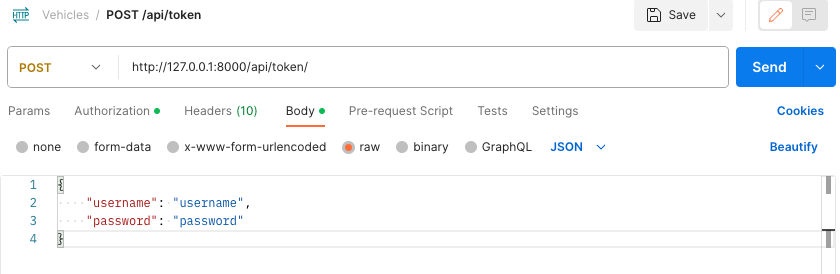

# Take Home Assessment

### SERVER SPECIFICATION
Create a Python with Django/Django Rest Framework server program that can receive HTTP
requests with a JSON formatted body payload. Based on the requests that this server program
receives, this program should be able store a list of vehicles that are in the garage, as well as
some relevant information on each one. The different types of vehicles are as follows: car, truck,
and boat.
Following REST Pattern,

### AUTHENTICATION
You are required to create an authentication flow for the server application.
All routes must be protected against anonymous usage.
Our recommendation is to use a token-based scheme utilizing the JWT standard, but that is not
a requirement. Creating an authentication flow may require you to make user accounts to go
along with the resources that are detailed below. You get to decide that though.

## Getting Started
- Clone the Repo: `git clone https://github.com/Trizzlenova/bixly_takehome.git`
- Change Directory: `cd bixly_takehome`
- Open in VS Code: `code .`
- Activate the python environment: `pipenv shell`
- Install the dependencies: `pipenv install`
- Run the app: `python manage.py runserver`

## Testing Instructions
Once the app is running:
- Open [Postman Desktop](https://www.postman.com/downloads/)
- On the upper left corner, click the `+` button to create a new project and name the project `Vehicles`
- Once you have the project, add a new request by clicking on the `...` next to the project name and click on `Add request` and follow the screenshot then click `Send`: 
