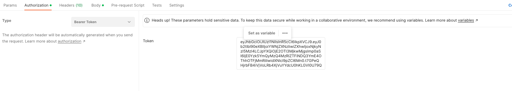
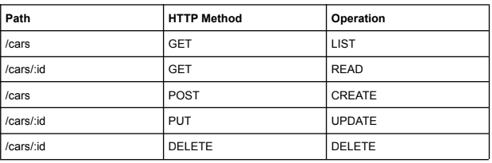
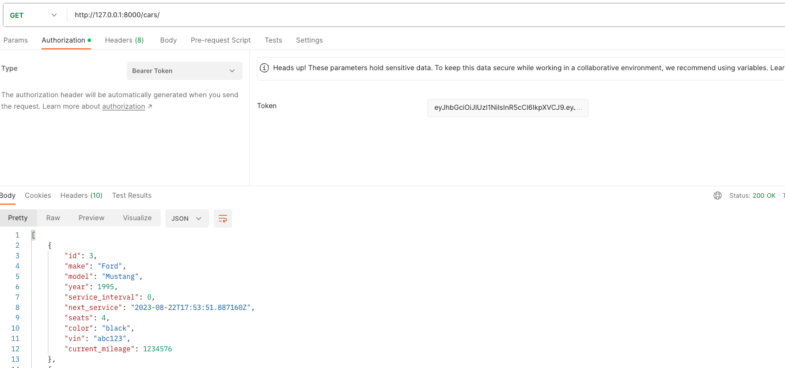
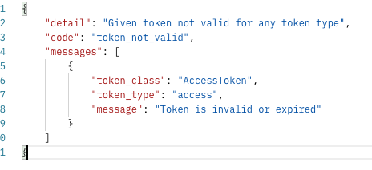

# Take Home Assessment

### SERVER SPECIFICATION
Create a Python with Django/Django Rest Framework server program that can receive HTTP
requests with a JSON formatted body payload. Based on the requests that this server program
receives, this program should be able store a list of vehicles that are in the garage, as well as
some relevant information on each one. The different types of vehicles are as follows: car, truck,
and boat.
Following REST Pattern,

### AUTHENTICATION
You are required to create an authentication flow for the server application.
All routes must be protected against anonymous usage.
Our recommendation is to use a token-based scheme utilizing the JWT standard, but that is not
a requirement. Creating an authentication flow may require you to make user accounts to go
along with the resources that are detailed below. You get to decide that though.

## Getting Started
- Clone the Repo: `git clone https://github.com/Trizzlenova/bixly_takehome.git`
- Change Directory: `cd bixly_takehome`
- Open in VS Code: `code .`
- Activate the python environment: `pipenv shell`
- Install the dependencies: `pipenv install`
- Run the app: `python manage.py runserver`

## Testing Instructions
Once the app is running:
- Open [Postman Desktop](https://www.postman.com/downloads/)
- On the upper left corner, click the `+` button to create a new project and name the project `Vehicles`
- Once you have the project, add a new request by clicking on the `...` next to the project name and click on `Add request` and follow the screenshot then click `Send`: 
- In the response, you'll see an object in the body: 
- Copy the value from the `"access"` key then go to the `Authorization`, select Type Bearer Token and paste the value into the textbox: 
- Each route will require this bearer token in order to run, there is routes for cars, trucks, and boats. Each one follows the same convention:  
Note: If you receive the following message when testing routes, run the authorization step again: 

## Technologies Used
[Django](https://docs.djangoproject.com/en/4.2/): Django is a high-level Python web framework that encourages rapid development and clean, pragmatic design. It provides a set of tools and conventions to help developers build web applications efficiently, handling tasks like URL routing, database interaction, templating, and more. Its "batteries-included" philosophy means it comes with many built-in features, making it a popular choice for building robust and scalable web applications.

[Django Rest Framework (DRF)](https://www.django-rest-framework.org/): Django Rest Framework is a powerful and flexible toolkit built on top of Django that simplifies the process of building Web APIs. It provides tools to serialize and deserialize complex data types, authentication and authorization mechanisms, viewsets for handling CRUD operations, pagination, filtering, and more. DRF enables developers to create RESTful APIs quickly and maintainably by leveraging Django's conventions and features.

[Django Rest Framework Simple JWT](https://django-rest-framework-simplejwt.readthedocs.io/en/latest/): Django Rest Framework Simple JWT is an extension for Django Rest Framework that adds JSON Web Token (JWT) authentication capabilities to your APIs. JWT is a compact and self-contained method for transmitting information between parties as a JSON object. This package provides an easy way to integrate JWT-based authentication, allowing users to securely authenticate and access protected API endpoints using tokens. It simplifies token generation, handling token expiration, and refreshing tokens for extended sessions.